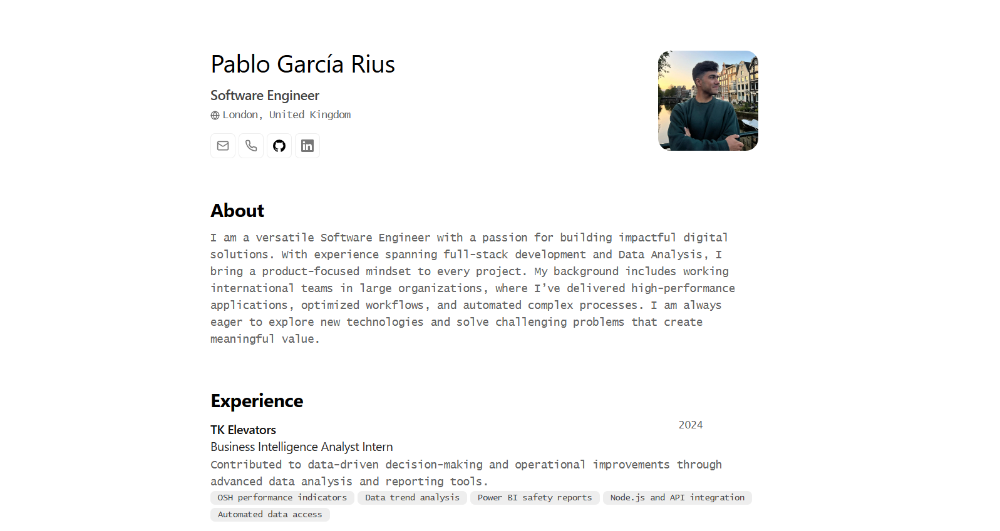

## 🖋️ Description

JSON Portfolio is a web portfolio built with **Astro**, designed to be lightweight, efficient, and highly customizable. All content is managed through a single **JSON** file, making updates and maintenance incredibly simple. This project is perfect for anyone seeking a fast, clean, and print-friendly portfolio.

---

## 🚀 Features

- **Pure minimalism:** Lightweight dependencies and a clean design prioritize fast load times.
- **Keyboard shortcuts:** Quickly navigate between sections using intuitive key combinations.
- **Print-ready:** Optimized for generating professional, high-quality PDFs.
- **Easy customization:** All content is centralized in a single JSON file for hassle-free edits.

---

## 🛠️ Tech Stack

- **Astro:** Framework used to build the project.
- **JSON:** Data structure defining all the portfolio content.
- **Vercel:** Hosting platform used for deployment.

---

## ✨ Why It's Special

1. **Ultra-lightweight:** Minimal dependencies ensure a fast and distraction-free experience.
2. **Easy to maintain:** Centralized content management makes updates seamless.
3. **Responsive design:** Perfectly adapts to any device, from mobile screens to large displays.
4. **Tailored for professionals:** Ideal for developers, designers, or anyone needing an impactful, efficient portfolio.

---

## 🌟 Screenshots



---

## 🛠️ How to Use

1. **Clone the repository:**
   ```bash
   git clone https://github.com/PabloRius/JSON-portfolio.git
   cd JSON-portfolio
   ```
2. **Install dependencies:**
   ```bash
   npm install
   ```
3. **Run the development server:**
   ```bash
   npm run dev
   ```
4. **Customize the content:**
   Edit the **_data.json_** file to add your own information.

---

## 🏗️ Next Steps

- Add support for dark and light themes.
- Incorporate more customizable keyboard shortcuts.
- Enhance accessibility and SEO optimization.
